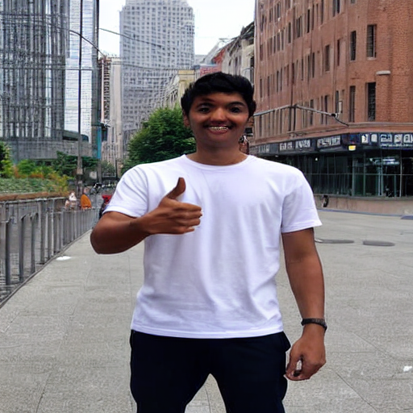

## Easel AI : Founding AI Engineer Assessment
### Stable Diffusion - Thumbs Up Challenge
### Sukruth Gowdru Lingaraju
HRI Researcher @ FARLabs, Cornell Tech | Masters in CS @ Cornell University  
Email: [sg2257@cornell.edu](mailto:sg2257@cornell.edu)  | [glsukki@gmail.com](mailto:glsukki@gmail.com)  
LinkedIn: [glsukruth](https://www.linkedin.com/in/glsukruth/)  
Website: [glsukki.github.io](https://glsukki.github.io/)

September 5th, 2023

### Baseline StableDiffusion Model - [runwayml/stable-diffusion-v1-5](https://huggingface.co/runwayml/stable-diffusion-v1-5?text=sukruth+thumbs+up)

#### Dataset: [glsukki/thumbs_up_v2](https://huggingface.co/datasets/glsukki/thumbs_up_v2)

<!-- #### Preprocessing
The images in the dataset were preprocessed to all be of type `JPEG` and of dimensions `512x512` -->

The dataset consists of 2 types of images & a metadata file  

* `<trigger_keyword> : 'thumbs up'`
    * `type: JPEG`
    * `#images: 121`
    * `shape: 512x512`
* `<person> : 'sukruth'`
    * `type: JPEG`
    * `#images: 336`
    * `shape: 512x512`
* `metadata : 'metadata.csv'`   
    - Contains information regarding `'image_file'`name & its corresponding `'caption'` for conditional training.

#### Model Training : [glsukki/stable-diffusion-thumbs-up-8000_1e-05](https://huggingface.co/glsukki/stable-diffusion-thumbs-up-8000_1e-05) (to be updated to the latest fine-tuned model)

The baseline model [`runwayml/stable-diffusion-v1-5`](https://huggingface.co/runwayml/stable-diffusion-v1-5?text=sukruth+thumbs+up) has been finetuned on the [`glsukki/thumbs_up_v2`](https://huggingface.co/datasets/glsukki/thumbs_up_v2) dataset to incorporate and generate images of a person (in this case: `sukruth`) displaying `'thumbs up'` gesture style when given a prompt of the style   

<p align="center">
   `prompt_style = <person> <trigger_keyword>`
</p>

The model was evaluated through a GridSearch having the parameters:

```
learning_rate = [1e-05, 1e-03]  
max_train_steps = [400, 2000, 4000, 8000]
```
The images generated (i.e: output) by the diffusion model is of `shape: 512x512`  
The models were trained on the Google Colab's `A100 Nvidia GPU` having 40 GB of runtime memory.

#### Inferences

Below are some of the images generated by the fine-tuned SD model trained on prompts of styles:  

1. `prompt_style = <person>...tokens...<trigger_word>`  

||
|:------------:|
|  |
| `Figure 1.1: max_train_steps = 4000, learning_rate = 1e-05, #images of <trigger_word> = 121 & #images of <person> = 58`|

||
|:------------:|
|  |
| `Figure 1.2: max_train_steps = 4000, learning_rate = 1e-05, #images of <trigger_word> = 121 & #images of <person> = 336` |


2. `prompt_style = <person><trigger_word>`  

| | | | |
|:-------------------------:|:-------------------------:|:-------------------------:| :-------------------------:|
| |   |  |  |  

`Figure 2.1: max_train_steps = 4000, learning_rate = 1e-05, #images of <trigger_word> = 121 & #images of <person> = 58`

Prompts `#1, #3, #11 - #17, #21, #22, #24, and #25:` in `Figure 2.2` have a very high resemblence to the training `<person>` images used during fine-tuning the baseline model.

| |  
|:------------:|
|  |

`Figure 2.2: max_train_steps = 4000 learning_rate = 1e-05, #images of <trigger_word> = 121 & #images of <person> = 336`

The images in `Figure 2.3` have a very high resemblence to the features of `<person>` images present in the training dataset.  

| | | | |
|:-------------------------:|:-------------------------:|:-------------------------:| :-------------------------:|
| |   |  |  |  

`Figure 2.3: max_train_steps = 8000, learning_rate = 1e-05, #images of <trigger_word> = 121 & #images of <person> = 336`

Models with the below parameters led to the generation of `NSFW` images.

```
max_train_steps = 8000, learning_rate = 1e-03, #images of <trigger_word> = 121 & #images of <person> = 336  
max_train_steps = 2000, learning_rate = 1e-03, #images of <trigger_word> = 121 & #images of <person> = 336
```

`NOTE:` 

1. The original images were resized to `shape: 512x512`, resulting in distorted facial features. These resized images were used as input during fine-tuning the baseline model. As a result, the models failed to generalize facial features accurately in the generated images. However, the models generated images having moderately well resemblence to the facial features _relative_ to the training images.
1. The lack of facial features being explictly seen/observed may also be due to the fact that there may be training data which are mapped to `<person>` caption - due to which the generalization may not be high (given: low data + compute resources on which the current models have been trained on).

#### Model Evaluation

As the images generated by the generative model - `StableDiffusion` - is subjective in nature, we can take 2 types of approaches in performing the evaluation of the model's output.

##### Qualitative Evaluation

Qualitative Evaluation implies the manual assessment of the images generated by the model.

Based on the generated images, manual assessment of fine-tune models are as below:

<style>
/* CSS styles for the sliding table */
    .sliding-table {
        overflow-x: auto;
        overflow-y: auto;
        height: 500px;
        }
</style>

<div class='sliding-table' markdown='block'>
|model_id|dataset_id|#image_thumbs_up|#images_sukruth|max_train_steps|learning_rate|assessment|
|---------|---------|---------|---------|---------|---------|---------|
|`glsukki/stable-diffusion-thumbs-up-test`|`glsukki/thumbs_up_v1`|	`121`|`58`|	`400`|`1e-05`|Model could not generalize well on 'sukruth' key word|
|`glsukki/stable-diffusion-thumbs-up-test`|`glsukki/thumbs_up_v1`|	`121`|`58`|	`4000`|`1e-05`|Model perfomed moderately when the prompt_style was - `<person_name> ...tokens... <thumbs up>`|
|`glsukki/stable-diffusion-thumbs-up-test`|`glsukki/thumbs_up_v1`|	`121`|`58`|	`4000`|`1e-05`|Model performed well when the prompt_style - `<person name> <thumbs up>`, got the 'hairstyle', 'posture', 'dressing fashion' of 'sukruth' very closely to the training images, but the 'facial' features were distorted|
|`glsukki/stable-diffusion-thumbs-up-8000`|`glsukki/thumbs_up_v2`|	`121`|`336`|`8000`|`1e-03`|Generated all NSFW content|
|`glsukki/stable-diffusion-thumbs-up-2000`|`glsukki/thumbs_up_v2`|	`121`|`336`|`2000`|`1e-03`|Since the above model generated all NSFW content on `max_train_steps=8000`, due to GPU resource constraints, the training steps has been changed to `max_train_steps=2000` for a quick model evaluation on the new dataset before running out of compute resource. `Inference:`Even after training the model on a lower max_train_steps, the model generated NSFW images for all prompts. Inference: this maybe due to learning_rate|
|`glsukki/stable-diffusion-thumbs-up-400`|`glsukki/thumbs_up_v2`|	`121`|`336`|`400`|`1e-05`|Fine tuning the base model on the new dataset (i.e: having greater number of `<person>` images) with the default learning rate to check if it still generates NSFW images as seen in the above two models. `Inference:` The model did not produce NSFW images for both styles of prompts. The `CLIP scores` observed for `prompt_style=<person><trigger_word>` was relatively lower when compared to `prompt_style=<person>...tokens...<trigger_word>`, which may be due to finding more similarity in the images to the token embeddings within the prompt. Next steps: Fine-tune the model on higher `max_train_steps` to check the results.|
|`glsukki/stable-diffusion-thumbs-up-4000`|`glsukki/thumbs_up_v2`|	`121`|`336`|`4000`|`1e-05`|Model did not generate NSFW content. Some of the images generated for the `prompt_style=<person>...tokens...<trigger_word>` had a moderate resemblence relative to the training data. Majority of the images for the `prompt_style=<person><trigger_word>` - upon manual observation, had very high resemblence to the 'hair', 'body language', 'clothing' features relative to the training data used for fine-tuning the base model.|
|`glsukki/stable-diffusion-thumbs-up-8000`|`glsukki/thumbs_up_v2`|	`121`|`336`|`8000`|`1e-05`|Model generated images with greater details, but the facial features still remained distorted.|

</div>

##### Quantitative Evaluation

A Quantitative Evaluation was performed on the generated images through the [`CLIP Score`](https://torchmetrics.readthedocs.io/en/stable/multimodal/clip_score.html) metric system.

[`CLIP Score`](https://torchmetrics.readthedocs.io/en/stable/multimodal/clip_score.html): measures the compatibility of the image-prompt pair on a scale of [0, 100]. Higher the score, greater the resemblence of the generated image for the given prompt.

Images were generated in 2 pipelines by setting a `seed` value to the pipeline generator. The first pipeline generated an image of `type: PIL Object` (to display the generated output) & the second pipeline generated (to calcualte the score) the corresponding `numpy.array(image)`.

The `CLIP Score` method takes in 2 arguments, the `numpy.array(image)` and its `prompt/caption` - to calculate the similarity of the `image` to its corresponding `prompt`.  

The `CLIP Score` evaluations can be seen in `Figure: 1.2, Figure: 2.2`.  

#### Roadblocks

1. The model was unable to train on the GPU Compute resources provided by the free version of Google Colab's - `T4 GPU` - having just 15 GB of runtime memory.
1. Unavailability of the `A100 Nvidia GPU` resource to connect for longer durations of time to train the model
1. Initially the model was trained on a dataset where `#images of <person> = 58`, this led to the model being unable to generalize well.  
The model was able to get the 'hairstyle' feature close to the actual resemblence of the same feature in the images provided during training.  
Upon increasing the `dataset size` and the `max_train_steps` the model's generalization improved.  
1. The `--push_to_hub` argument provided by `HuggingFace` [fine-tuning documentation](https://huggingface.co/docs/diffusers/training/text2image#finetuning) was incomplete & failed to push the fine-tuned trained model to the `HuggingFace` repository + a bug in the model's `train_text_to_image.py` script, where the weights and biases library was not being imported while being referenced.  
    * Fix:  
        * had to incorporate & provide the `--validation_prompt=<person><trigger_keyword>` as an arugment while training the model on the custom dataset
        * had to import the `wandb` library in the fine-tuning script
1. The SD model generalized moderately when generating images when given the prompt `<person> ...tokens... <trigger_word>`, but generalized relatively well for the prompt - `'<person> <trigger_keyword>'`   
    - this I believe could be due to the lack of `<person> ...tokens... <trigger_word>` caption data provided for conditional training.

#### Files enclosed

1. `Easel_AI_v2.ipynb` : A Google Colab Notebook which contains the working demo of the fine-tuned Stable Diffusion [`runwayml/stable-diffusion-v1-5`](https://huggingface.co/runwayml/stable-diffusion-v1-5?text=sukruth+thumbs+up) model to incorporate a user defined image (`<person>`) when given the prompt of the style `<person><thumbs up>`.
1. `create_dataset.py` : A python script used for resizing training images to be of the `shape: 512x512`.
1. `to_jpeg.py` : A python script used to convert training images to be of `type: JPEG`.
1. `push_to_hub.py` : A python script used to push the training dataset to the HuggingFace dataset repository.
1. `imagesfolder` : Training images dataset.
1. `model_generated_images`: images generated by various models during testing.
1. `model_version_metadata.xlsx`: fine-tuned model version log
1. `README.md`
